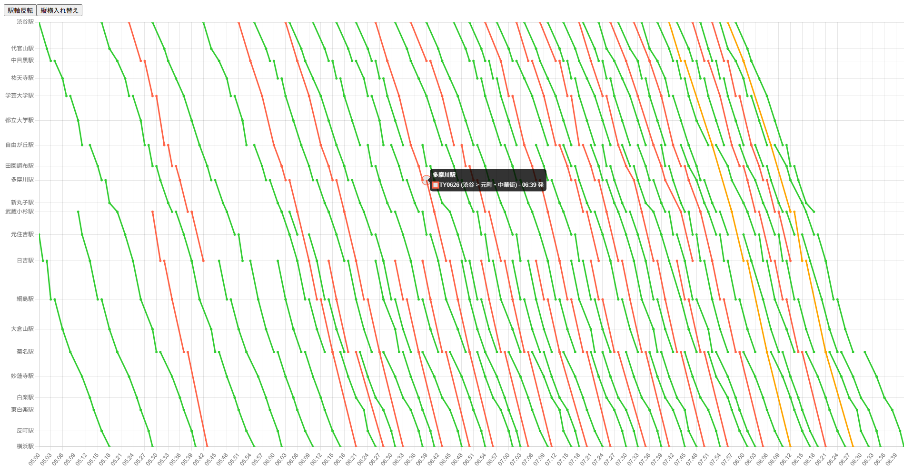

# Train Diagram App

- Angular 21 を用いて作成した鉄道ダイヤグラム表示アプリです。  
- Chart.js により、CSV 形式の時刻表データをもとに列車の運行を可視化します。
- ブラウザ上で鉄道ダイヤグラム（列車運行図表）をインタラクティブに表示できます。

## 🌐 Live Demo
https://tankmkni.github.io/train-diagram-app/

## 🚀 Deployment
本アプリは GitHub Pages を使用して公開しています。  
サーバーを必要としない、フロントエンドのみの静的アプリケーションです。

## ⚙️ Tech Stack
- Angular 21
- TypeScript
- Chart.js

## 🧩 Core Features
- 鉄道ダイヤグラム表示
- CSV 形式の時刻表データ読み込み

## ✨ Additional Features
- 駅軸に実際の営業距離比率を反映した表示
- ボタン操作による XY 軸入れ替え & 駅軸反転
- Tooltip に駅 & 列車情報表示 
- 列車種別ごとの色分け

## 📝 Notes
- 現在はフロントエンドのみの実装です
- サンプルの時刻表データ（CSV）を含んでいます
- node_modules はリポジトリに含まれていません
- 開発・実行方法については Angular 公式ドキュメントを参照してください  
  https://angular.dev/